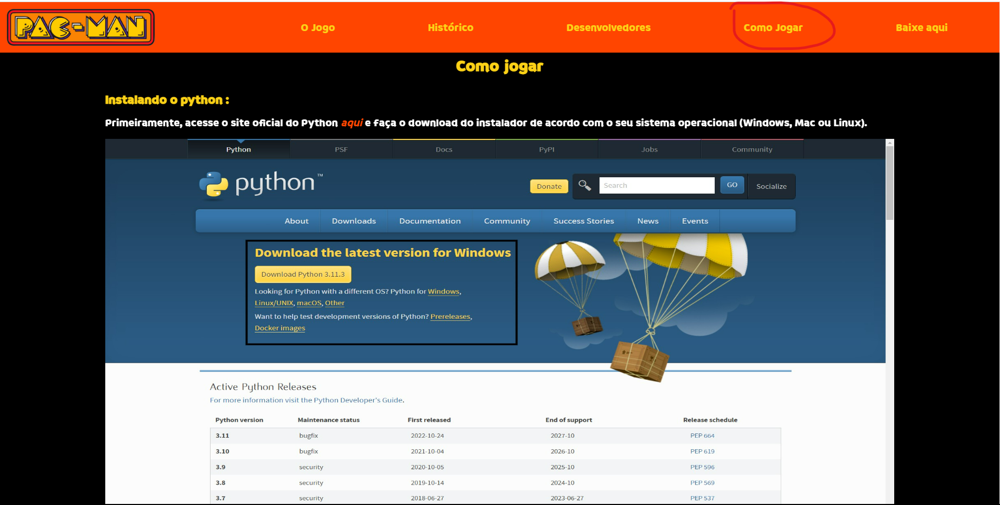

# InsPac-Man

## Overview
A ideia desse projeto é criar uma replica do famoso jogo Pac-Man. Esse jogo foi desenvolvido pelos alunos [**Mateus Moreira**](https://www.linkedin.com/in/mateus-moreira-8a8bb1214/) e [**Giovanny Russo**](https://www.linkedin.com/in/giovanny-russo-8a8b261b2/), ambos de ciência da computação do insper. Para mais detalhes entre no [site do projeto](https://insper-classroom.github.io/devlife-23-1-projeto-pygame-mateus_giovanny/)

---
## Instalação

Primeiro é preciso ter o python instalado no seu computador, se ainda não tem entre no site do projeto na aba de como baixar e siga o tutorial lá, [clique aqui](https://insper-classroom.github.io/devlife-23-1-projeto-pygame-mateus_giovanny/) para ir pro site.

Tendo o python instalado, vamos instalar o jogo. Primeiro baixe o aquivo compactado do repositório clicando [aqui](https://github.com/insper-classroom/devlife-23-1-projeto-pygame-mateus_giovanny/raw/main/jogo.rar)