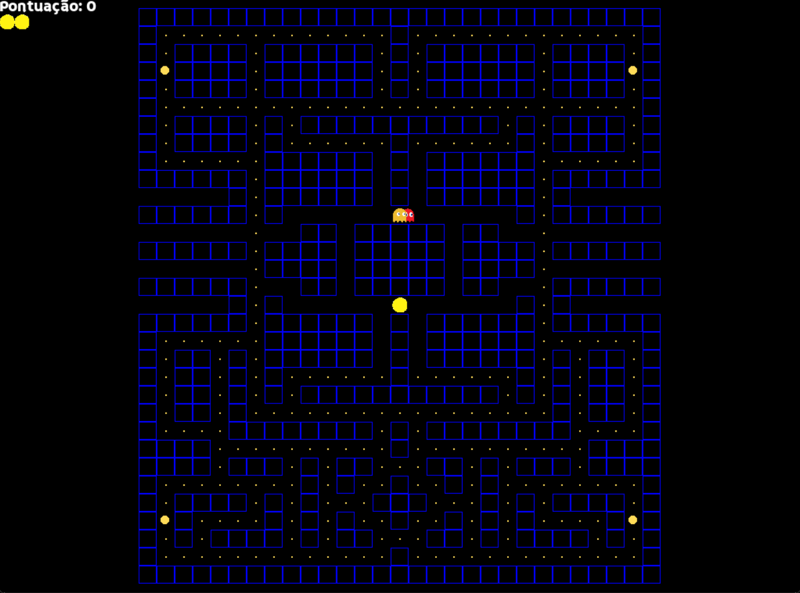
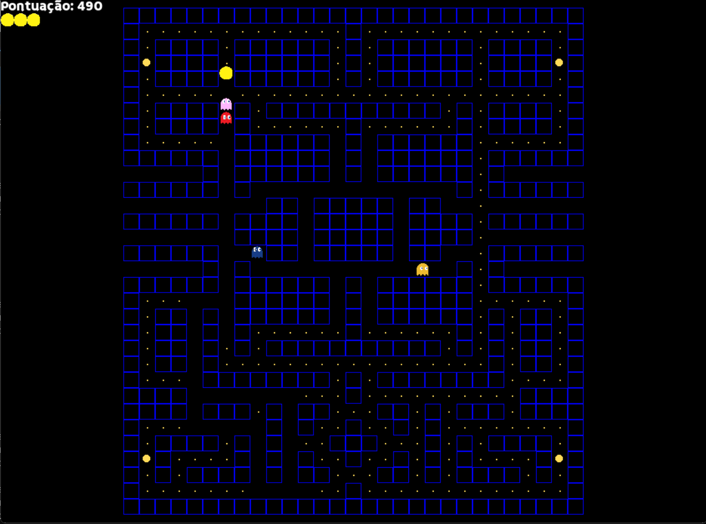
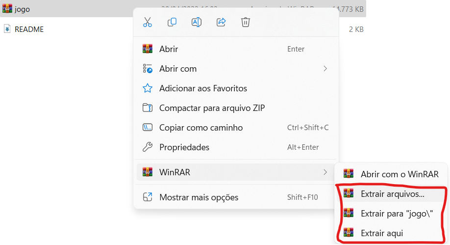

# InsPac-Man

## Overview
A ideia desse projeto é criar uma replica do famoso jogo Pac-Man usando pygame. Esse jogo foi desenvolvido pelos alunos [**Mateus Moreira**](https://www.linkedin.com/in/mateus-moreira-8a8bb1214/) e [**Giovanny Russo**](https://www.linkedin.com/in/giovanny-russo-8a8b261b2/), ambos de ciência da computação do insper. Para mais detalhes entre no [site do projeto](https://insper-classroom.github.io/devlife-23-1-projeto-pygame-mateus_giovanny/)

 

---
## Instalação

Primeiro é preciso ter o python instalado no seu computador, se ainda não tem entre no site do projeto na aba de como baixar e siga o tutorial lá, [clique aqui](https://insper-classroom.github.io/devlife-23-1-projeto-pygame-mateus_giovanny/) para ir pro site.


Tendo o python instalado, vamos instalar o jogo. Primeiro baixe o aquivo compactado do jogo clicando [aqui](https://github.com/insper-classroom/devlife-23-1-projeto-pygame-mateus_giovanny/raw/main/jogo.rar)
Depois use um desconpactador de arquivos para extrair os arquivos.



Com isso feito, abra o seu terminal e digite:

```bash
cd caminho_até_a_pasta_do_jogo
```

Você pode pegar o caminho no explorador de arquivos do windows. É so dar ctr+c e depois ctrl+v no terminal. O ctrl+v pode não funcionar em alguns computadores, aí é só clicar com o botão direito no terminal que ele cola o caminho :)


Feito isso, execute o seguinte comando no seu terminal:

```bash
python play.py
```
ou

```bash
python3 play.py
```

Agora que você já sabe como executar o jogo, é só se divertir.